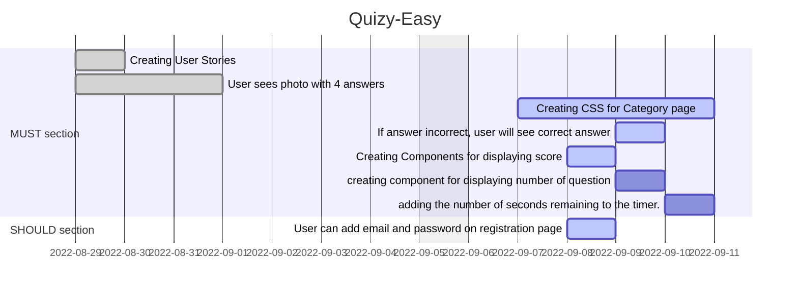

```mermaid

gantt
dateFormat  YYYY-MM-DD
title Quizy-Easy
excludes weekdays 2022-09-05

section MUST section
Creating User Stories                                 :done,    des1, 2022-08-29, 1d
User sees photo with 4 answers                        :done,    des2, 2022-08-29, 3d
Creating CSS for Category page                        :active,  des3, 2022-09-07, 2022-09-11

If answer incorrect, user will see correct answer     :active,  des5, 2022-09-09, 1d
Creating Components for displaying score              :active,  des6, 2022-09-08, 1d
creating component for displaying number of question  :         des7, after des6, 1d
adding the number of seconds remaining to the timer.  :         des8, after des7, 1d


section SHOULD section
User can add email and password on registration page  :active,  des4, 2022-09-08, 1d
```
